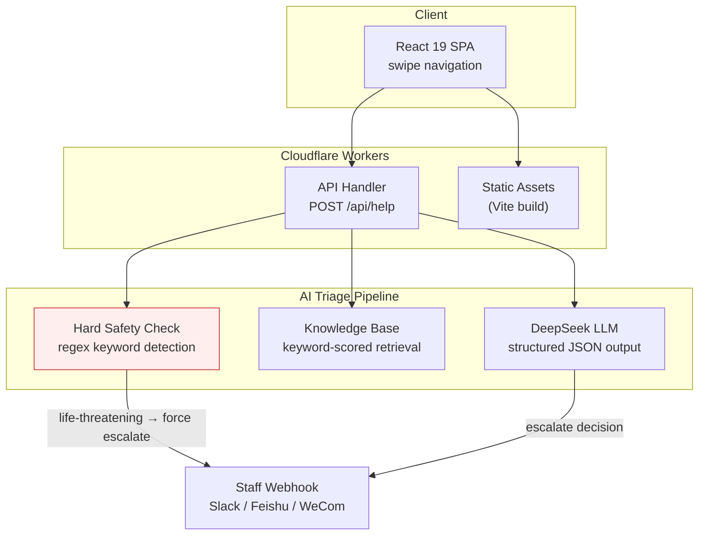

# We Are in Tohoku (我们在東北)

Community service portal for the Tohoku Region Chinese Students and Scholars Association (東北地区中国学友会). A mobile-first single-page app with an AI-powered anonymous help system.

**Live:** [tohokucssa.org](https://tohokucssa.org)

## What It Does

A one-stop portal for Chinese international students in the Tohoku region of Japan. The platform aggregates 14 service categories — from event management and free translation to emergency contacts and campus bus schedules — into a swipe-navigable mobile interface.

The standout feature is **anonymous help with AI triage**: students submit questions anonymously, and a multi-stage pipeline decides whether the AI can answer directly or whether the request needs human staff intervention. Life-threatening situations bypass the AI entirely through a hard safety layer.

## Architecture



## AI Triage Pipeline

The anonymous help system processes each request through three layers:

### 1. Hard Safety Check (`worker/safety.js`)

Regex-based detection of critical keywords: suicide/self-harm, violence/assault, medical emergencies, legal crises. **If matched, the request is forcibly escalated to staff with "urgent" priority — the AI's decision is overridden.** This ensures life-threatening situations are never left to model judgment alone.

```
User message → regex match → FORCE escalate (urgent) → staff webhook
```

### 2. Knowledge Base Retrieval (`worker/kb.js`)

Keyword-scored retrieval against a curated knowledge base covering emergency numbers, embassy contacts, mental health resources, translation services, vehicle lending, moving assistance, and second-hand marketplace. Matched entries are injected as context for the LLM.

### 3. LLM Triage (`worker/triage.js`)

The user's message + retrieved KB context is sent to DeepSeek with a detailed system prompt. The model outputs structured JSON:

```json
{
  "action": "answer" | "escalate",
  "urgency": "low" | "normal" | "urgent",
  "category": "翻译",
  "answer": "...",
  "summary_for_staff": "..."
}
```

**Conservative fallback:** If the API call fails or the response can't be parsed, the system defaults to escalation — never to a fabricated answer.

### 4. Staff Notification (`worker/notify.js`)

Escalated requests trigger a webhook notification (compatible with Slack, Feishu, WeCom bots) with urgency level, category, and a summary for the staff.

## Tech Stack

| Layer | Technology |
|-------|-----------|
| Frontend | React 19 + Vite 8 |
| Backend | Cloudflare Workers |
| AI | DeepSeek API (OpenAI-compatible, `deepseek-chat`) |
| Notifications | Webhook (Slack / Feishu / WeCom) |
| Deployment | Cloudflare Pages + Workers, custom domain |
| Linting | Oxlint |

## Features

### Service Portal (14 categories)

| Category | Status | Description |
|----------|--------|-------------|
| Events (活动) | Live | Links to [events.tohokucssa.org](https://events.tohokucssa.org) |
| Anonymous Help (匿名求助) | Live | AI-powered triage (see above) |
| Translation (翻译) | Planned | Free Chinese-Japanese translation volunteer service |
| Car Lending (租车) | Planned | Association vehicle borrowing |
| Emergency (应急) | Planned | Police/fire/embassy contacts, disaster alerts |
| Second-hand (二手) | Planned | Buy/sell/give-away marketplace |
| Moving (搬家) | Planned | Moving assistance and tips |
| Campus Bus (校园巴士) | Planned | Schedules and route maps |
| Equipment (设备租用) | Planned | BBQ sets, projectors, camping gear |
| Food Map (美食地图) | Planned | Restaurant recommendations |
| Daily Life (生活必备) | Planned | Links to LINE, PayPay, Mercari, SUUMO |
| Academic (学术研究) | Planned | Links to CiNii, Google Scholar, J-STAGE |
| Transport (交通防灾) | Planned | NAVITIME, Yahoo alerts, JR East |

### Mobile-First UX

- Touch swipe navigation between category pages with dot indicators
- Keyboard arrow key support for desktop
- Responsive layout (phone / tablet / desktop breakpoints)
- Bottom tab bar navigation

## Project Structure

```
src/
  Board.jsx          # Main portal UI — swipe navigation, 14 service pages
  App.jsx            # Root component (header/footer)
worker/
  index.js           # Cloudflare Worker entry, API routing
  triage.js          # AI triage orchestration
  deepseek.js        # DeepSeek LLM client (OpenAI-compatible)
  kb.js              # Knowledge base + keyword retrieval
  safety.js          # Hard safety escalation (regex, overrides AI)
  notify.js          # Staff webhook notification
```

## Local Development

```bash
npm install
npx wrangler dev          # API server on :8787
npm run dev               # Vite dev on :5174 (proxies /api → :8787)
```

Requires `.dev.vars` with `DEEPSEEK_API_KEY` and optionally `STAFF_WEBHOOK_URL`.

## License

Private — not open source.
